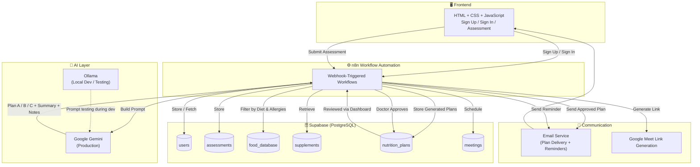
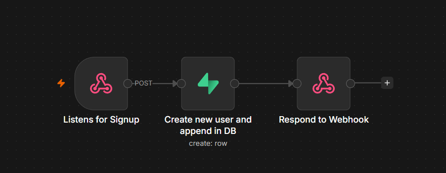
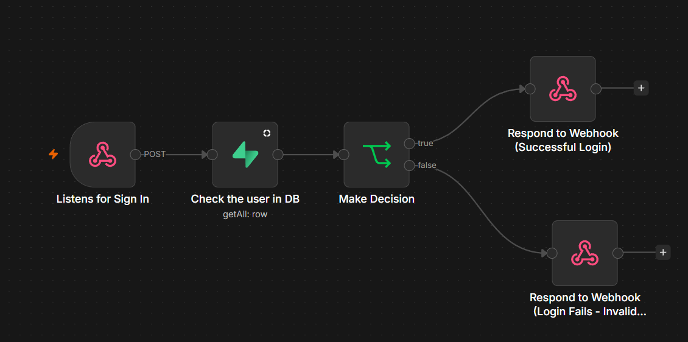
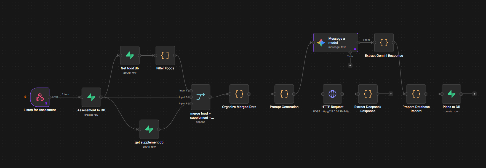
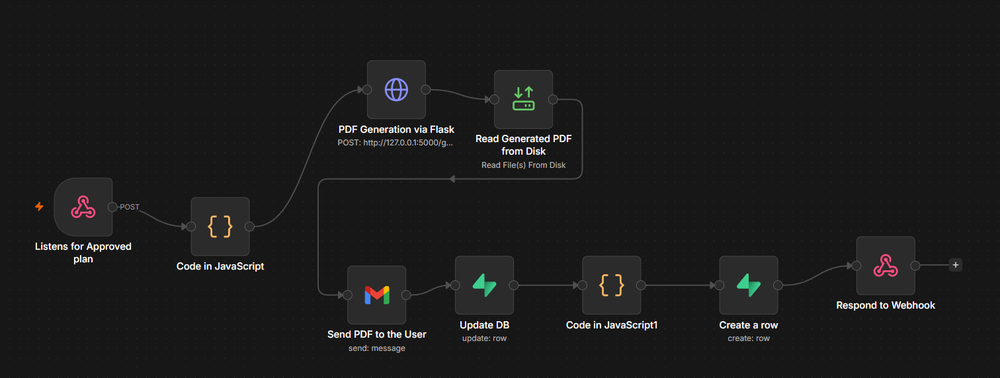
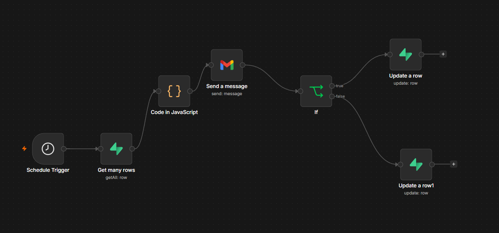

<div align="center">

### 🎓 This project was developed during my SAP Labs Internship (May 2026 – June 2026).

</div>

<div align="center">

[](https://git.io/typing-svg)


</div>

---

## 📖 About the Project

**AI-Powered Nutrition Platform** is an end-to-end platform that automates the complete nutrition consultation lifecycle — from client onboarding to personalized diet plan generation, nutritionist review, appointment scheduling, and automated email notifications.

The platform combines a lightweight web frontend with a fully automated **n8n workflow backend**, using **Google Gemini** to generate personalized nutrition plans and **Supabase (PostgreSQL)** as the central data store. The goal is to reduce the manual effort involved in traditional nutrition consultation by automating assessment intake, plan generation, doctor approval, scheduling, and communication.

**Core lifecycle:**

- Client Registration & Login
- Digital Nutrition Assessment
- AI-Powered Personalized Nutrition Plan Generation
- Nutritionist / Doctor Review & Approval
- Appointment Scheduling
- Nutrition Plan Delivery via Email
- Automated Appointment Reminders

---

## ✨ Key Features

### 👤 Client Features
- Secure Sign Up & Sign In
- Digital Nutrition Assessment Form
- Receive Approved Nutrition Plan via Email
- Receive Appointment Reminder Emails
- View Scheduled Follow-up Meetings

### 🩺 Nutritionist Features
- Nutritionist Review Dashboard
- View Assessment Details
- Compare AI-Generated Plan A / Plan B / Plan C
- Edit Meals & Food Quantities
- Approve Final Nutrition Plan
- Schedule Follow-up Meetings & Generate Google Meet Links

### 🤖 AI Features
- Personalized Nutrition Plan Generation (Google Gemini)
- Dynamic Food Recommendation from Filtered Food Database
- Supplement Recommendation
- Allergy & Dietary Preference Filtering
- Nutrition Summary & Nutritionist Notes Generation
- Ollama used for local LLM prompt testing during development

### ⚙️ Automation Features
- Fully automated **n8n** backend workflows
- Webhook-triggered assessment intake
- Automated email delivery on plan approval
- Scheduled reminder workflow for upcoming appointments

---

## 🧩 Tech Stack

| Layer | Technology |
|---|---|
| **Frontend** | HTML5, CSS3, JavaScript |
| **Backend** | n8n Workflow Automation |
| **Database** | Supabase (PostgreSQL) |
| **AI / LLM** | Google Gemini (production), Ollama (local dev/testing) |
| **Other** | REST APIs, Webhooks, JSON, Git & GitHub |

---

## 🏗️ System Architecture



---

## 🔄 End-to-End Workflow

```text
Client Sign Up / Sign In
          │
          ▼
Nutrition Assessment Submitted
          │
          ▼
Assessment Stored in Supabase
          │
          ▼
Retrieve Food Database
          │
          ▼
Filter Foods by Dietary Preference & Allergies
          │
          ▼
Retrieve Supplement Database
          │
          ▼
Prepare AI Prompt
          │
          ▼
Google Gemini generates Plan A / Plan B / Plan C
          │
          ▼
Store Generated Plans in Supabase
          │
          ▼
Nutritionist Dashboard — Review & Edit
          │
          ▼
Doctor Approves Plan
          │
          ▼
Schedule Follow-up Meeting(s) + Generate Meet Link
          │
          ▼
Send Approved Nutrition Plan via Email
          │
          ▼
Automated Appointment Reminder Emails
```

---

## ⚙️ Backend Workflows (n8n)

Each workflow below is triggered by a webhook from the frontend or by a scheduled trigger, and runs independently inside n8n.

---

### 1️⃣ Sign Up Workflow

Handles new client registration — validates input, hashes/stores credentials, and creates a new record in the `users` table in Supabase.

**n8n Workflow**



---

### 2️⃣ Sign In Workflow

Validates client credentials against the `users` table and authenticates the client into the dashboard.

**n8n Workflow**



---

### 3️⃣ Assessment & Nutrition Plan Generation Workflow

Collects the client's full nutrition assessment (personal info, medical history, lifestyle, dietary recall, allergies, symptoms, medications, preferences), then runs the AI pipeline end to end:

```
Assessment Submitted
        ↓
Stored in Supabase
        ↓
Retrieve Food Database
        ↓
Filter Foods (Diet Preference + Allergies)
        ↓
Retrieve Supplement Database
        ↓
Prepare AI Prompt
        ↓
Google Gemini
        ↓
Generate Plan A / Plan B / Plan C + Summary + Notes
        ↓
Store Generated Plans in Supabase
```

**n8n Workflow**



---

### 4️⃣ Nutrition Plan Email Workflow

Once a plan is approved, this workflow builds the email template (plan details, supplements, nutritionist notes, meeting details) and sends it to the client automatically.

**n8n Workflow**



---

### 5️⃣ Appointment Reminder Workflow

Runs on a scheduled/cron trigger, checks upcoming meetings, and sends a reminder email to the client with the meeting date, time, and Meet link.

**n8n Workflow**



---

## 🤖 AI Workflow (Detail)

```
Assessment
    ↓
Food Filtering (Diet + Allergies)
    ↓
Supplement Retrieval
    ↓
Prompt Engineering
    ↓
Google Gemini
    ↓
JSON Response (Plan A / B / C, Summary, Supplements, Notes)
    ↓
Store Nutrition Plan in Supabase
```

Ollama was used locally during development for rapid prompt iteration and testing before finalizing prompts for production use with Google Gemini.

---

## 🗄️ Database Design (Supabase)

| Table | Stores |
|---|---|
| `users` | Client login credentials & profile details |
| `assessments` | Complete nutrition assessment data (JSON) |
| `food_database` | Food items with calories, protein, carbs, diet preference & allergy tags |
| `supplements` | Supplement information |
| `nutrition_plans` | AI-generated plans, approval status, supplements, notes, linked assessment ID |
| `meetings` | Meeting date, time, Meet link, status |

---

## 📂 Project Structure

```
AI-powered-nutrition-platform/
├── frontend/
│   ├── index.html
│   ├── signup.html
│   ├── signin.html
│   ├── assessment.html
│   ├── dashboard.html
│   ├── css/
│   └── js/
├── workflows/
│   ├── signup-workflow.json
│   ├── signin-workflow.json
│   ├── assessment-workflow.json
│   ├── plan-generation-workflow.json
│   ├── approval-workflow.json
│   ├── scheduling-workflow.json
│   ├── email-workflow.json
│   └── reminder-workflow.json
├── docs/
│   └── screenshots/
└── README.md
```

---

## ⚙️ Getting Started

### Prerequisites
- A Supabase project (PostgreSQL database)
- An n8n instance (cloud or self-hosted)
- A Google Gemini API key
- (Optional) Ollama installed locally for prompt testing

### 1. Clone the repository
```bash
git clone https://github.com/Soorya-SS-01/AI-powered-nutrition-platform.git
cd AI-powered-nutrition-platform
```

### 2. Set up Supabase
Create the tables: `users`, `assessments`, `food_database`, `supplements`, `nutrition_plans`, `meetings`.

### 3. Import n8n workflows
Import the workflow JSON files from the `workflows/` folder into your n8n instance and configure:
- Supabase credentials
- Google Gemini API key
- Email/SMTP credentials
- Webhook URLs

### 4. Connect the frontend
Update the webhook endpoints in the frontend JavaScript files to point to your n8n instance.

### 5. Run
Open `frontend/index.html` in a browser (or serve it via any static host) and start using the platform.

---

## 🚀 Future Enhancements

- RAG-based Nutrition Knowledge Base
- OCR Medical Report Analysis
- AI Chatbot for Client Support
- Mobile Application
- Progress Tracking Dashboard
- Wearable Device Integration

---

## 📈 Key Highlights

✅ End-to-End Workflow Automation with n8n
✅ AI-Powered Personalized Nutrition Planning
✅ Google Gemini Integration
✅ Ollama Local LLM Integration for Development
✅ Dynamic Food Recommendation & Filtering
✅ Allergy & Diet Preference Filtering
✅ Nutritionist Approval Dashboard
✅ Automated Appointment Scheduling
✅ Automated Email Notifications & Reminders
✅ Supabase Integration
✅ REST API & Webhook Communication

---

## 👤 Author

**Soorya S S**
B.Tech Computer Science and Business Systems

[GitHub](https://github.com/Soorya-SS-01) · [LinkedIn](https://www.linkedin.com/in/soorya-s-s-364839370)


